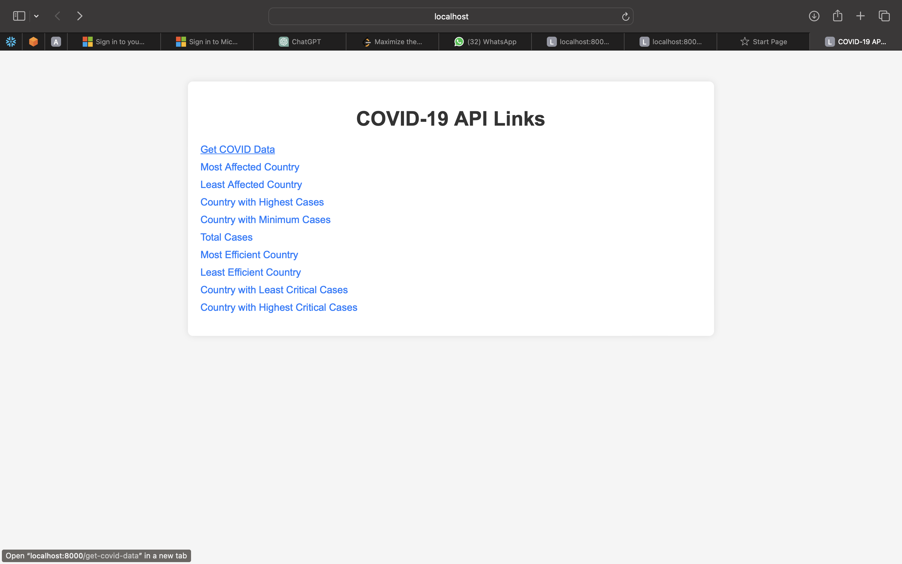
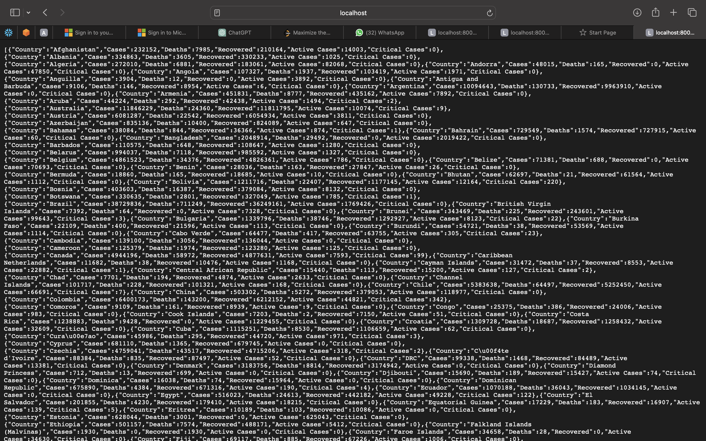
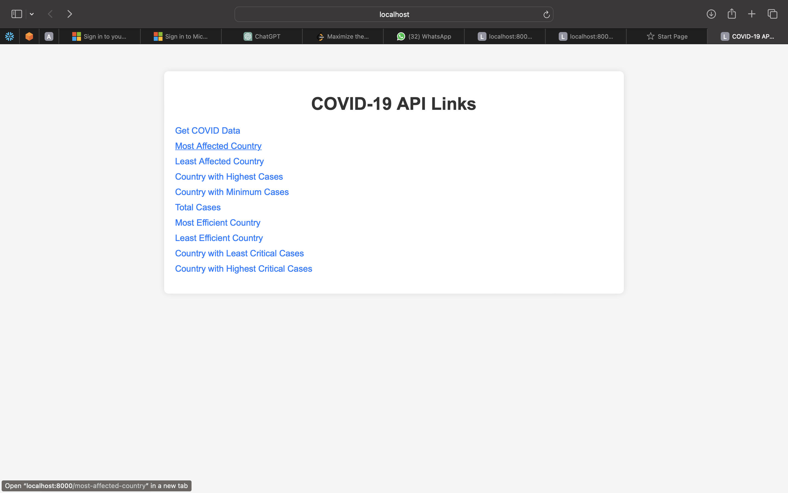
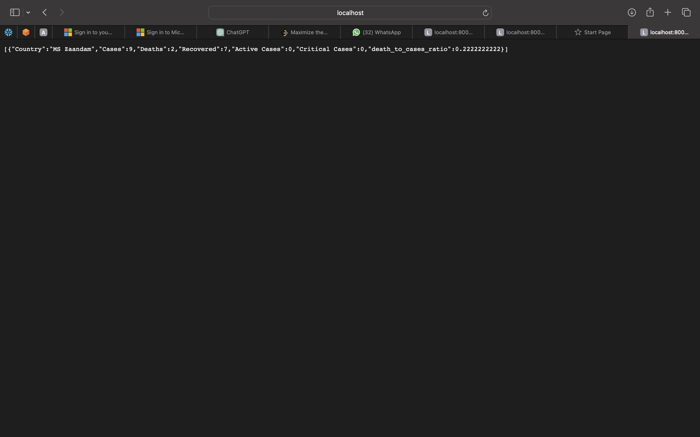

# Spark COVID-19 Data Analysis

This project utilizes Python Notebooks for analyzing COVID-19 data. It includes two main notebooks:

- `api_to_csv.ipynb`: Python Notebook for fetching COVID-19 data from an API and saving it to a CSV file.
- `data_analyse.ipynb`: Python Notebook for analyzing the fetched COVID-19 data, generating insights, and running an HTTP server to expose RESTful APIs.

## Overview

### api_to_csv.ipynb

This notebook performs the following tasks:
- Fetches COVID-19 data from an external API.
- Processes the fetched data.
- Saves the processed data to a CSV file.

### data_analyse.ipynb

This notebook performs the following tasks:
- Reads the COVID-19 data from the CSV file.
- Analyzes the data to generate insights such as:
  - Most affected country
  - Least affected country
  - Total cases
  - Country with highest cases
  - Country with minimum cases
  - Most efficient country
  - Least efficient country
  - Country with least critical cases
  - Country with highest critical cases
- Additionally, it includes HTTP server code for running an HTTP server that exposes RESTful APIs to access the analyzed COVID-19 data.

## Usage

1. Open the `api_to_csv.ipynb` notebook in Jupyter Notebook or JupyterLab.
2. Run the notebook cells to fetch and process the COVID-19 data and save it to a CSV file.
3. Open the `data_analyse.ipynb` notebook.
4. Run the notebook cells to analyze the fetched COVID-19 data, generate insights, and start the HTTP server to access the RESTful APIs.

## Dependencies

- Python Notebook
- Pandas
- Requests (for fetching data from the API)
- Spark
- Other dependencies as required (specified within the notebooks)

